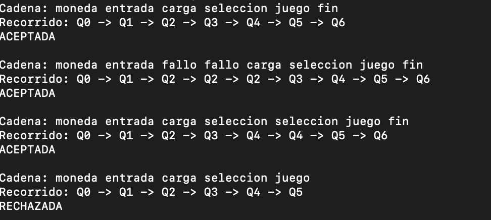

## Maquina de autómatas de Estados Finitos 

Para este ejercicio se implementó una maquina de videojuegos de centro comercial en donde la maquina contiene los siguientes estados:

El diagrama anterior muestra que el autómata parte desde el estado inicial Q0, y progresa a través de los estados Q1, Q2, Q3, Q4 y Q5, hasta llegar al estado final Q6, donde el proceso concluye. Cada transición está definida por una condición específica: comienza con la inicialización, continúa con la lectura de entradas, luego se repite un estado de verificación hasta que la condición se cumpla, después se realiza la carga del juego, la selección del mismo, la ejecución de la partida y finalmente la finalización una vez que el juego termina.

## Ejecución del programa 

Los primeros pasos para ejecutar el programa son lo siguientes:

1. Se encontrarán dos carpetas las cuáles deben ser descargadas al ordenador donde mas adelante se realizará la ejecución del autómata propuesto, el nombre de dichas carpetas son Código C y Codigo Python las cuales contienen el código para ejecutar llamado Automata.c y Automata.py. En adición allí mismo se encuentran los archivos de configuración y prueba llamados Conf.txt y Cadenas.txt para el archivo de prueba.

2. Una vez descargados en la carpeta elegida por el usuario, se debe abrir en terminales (ya sea Linux o MacOs) diferentes la carpeta Código C y Código Python.

3. Se empezará la prueba con el código Python o viceversa el que el usuario deseé, para el código de Python en terminal se aplicarán los siguientes comandos 

 - Comando "Python3 Automata.py"

   

Esto ejecutará la lógica del código Python creado con anterioridad y a su vez arrojará por terminal la lectura de la cadena del autómata finito y en adición indicará si las cadenas de ejemplo son aceptadas o no, todo esto de acuerdo a la configuración establecida por el "Conf.txt" de dicho autómata 

4. Ejecución terminal carpeta Código C: Una vez estando en la terminal de la carpeta C se ejecutarán unos códigos adicionales para llegar a la ejecución final del ejercicio.

 -  Primero se complilará y creará el ejecutable del programa  usando el siguiente comando "gcc Automata.c -o Automata"

    

 - Segundo se ejecutará el programa haciendo uso del comando ./Automata

    
  
Una vez el programa se ejecute correctamente, encontraremos una salida por consola la cual debería validar si las cadenas de ejemplo implementadas para el autómata son aceptadas o no 
 

Este ejercicio muestra como un autómata de estados finitos realiza su verificación paso a paso para así lograr su correcto funcionamiento y llegar al objetivo clave de brindar la funcionalidad de un programa en específico, esto siguiendo sus reglas gramaticales como lo propone su creación.
