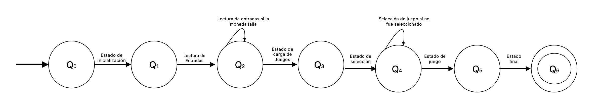

## Maquina de autómatas de Estados Finitos 

Para este ejercicio se implementó una maquina de video juegos de centro comercial en donde la maquina contiene los siguientes estados:

En donde se observa con anterioridad que los estados parten desde un estado Q0(estado inicial)