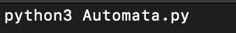
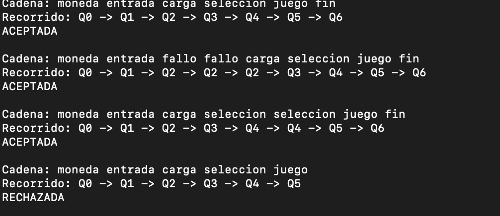

## Maquina de autómatas de Estados Finitos 

Para este ejercicio se implementó una maquina de video juegos de centro comercial en donde la maquina contiene los siguientes estados:

El diagrama muestra que el autómata parte desde el estado inicial Q0, y progresa a través de los estados Q1, Q2, Q3, Q4 y Q5, hasta llegar al estado final Q6, donde el proceso concluye. Cada transición está definida por una condición específica: comienza con la inicialización, continúa con la lectura de entradas, luego se repite un estado de verificación hasta que la condición se cumpla, después se realiza la carga del juego, la selección del mismo, la ejecución de la partida y finalmente la finalización una vez que el juego termina.

## Ejecución del programa 

Los primeros pasos para ejecutar el programa son lo siguientes:

1. Se localizan dos carpetas las cuales deben ser descargadas al ordenador donde mas tarde se implementará la ejecución del autómata propuesto, el nombre de dichas carpetas son Código C y Código Python las cuales contienen el código para ejecutar llamado Automata.c y Automata.py. En adición allí mismo se encuentran los archivos de configuración y prueba llamados Conf.txt y Cadenas.txt

2. Una vez descargados en la carpeta elegida por el usuario, se debe abrir en terminales diferentes la carpeta Código C y Código Python.

3. Se empezará la prueba con el código Python o viceversa el que el usuario deseé, para el código de Python en terminal se aplicarán los siguientes comandos 

 - Comando "Python3 Automata.py"

   

Esto arrojará por terminal la lectura de la cadena de del autómata finito y en adición indicará si las cadenas de ejemplo son aceptadas o no, de acuerdo a la configuración de dicho autómata 

 

 